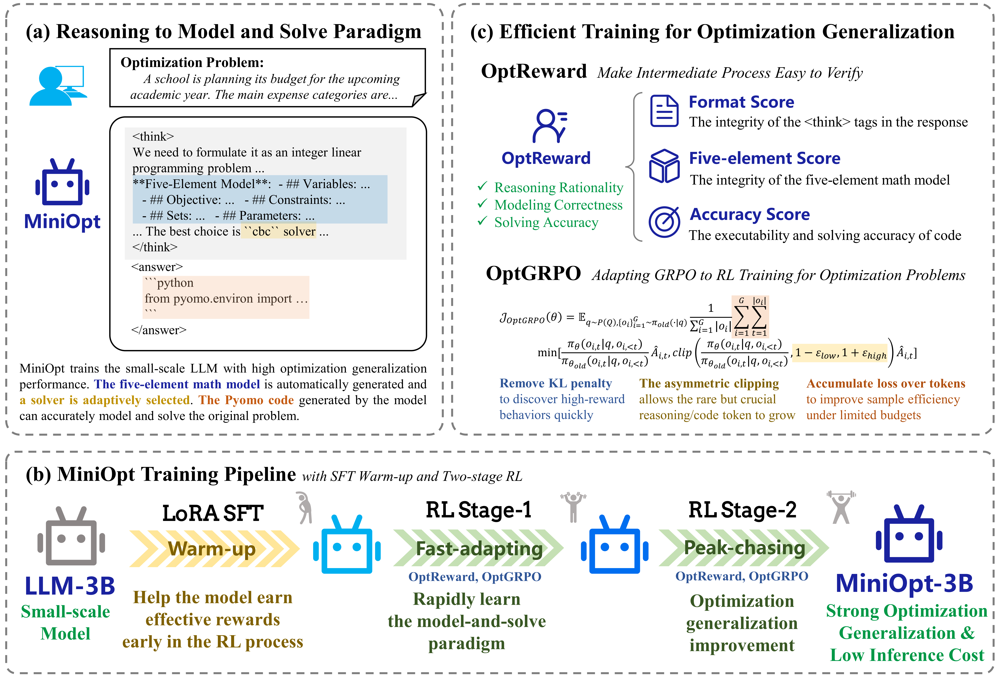

<h2 align="center">MiniOpt: Reasoning to Model and Solve General Optimization Problems with Limited Resources </h2>
<p align="center">
    <a href="https://github.com/ZhaoKe1024"><strong>Ke Zhao</strong></a><sup>1,*</sup>
    ·
    <a href="#"><strong>Zixiang Di</strong></a><sup>1,*</sup>
    ·
    <a href="https://github.com/HQian-AI"><strong>Hong Qian</strong></a><sup>1,†</sup>
    ·
    <a href="https://github.com/Hsiang-1"><strong>Xiang Shu</strong></a><sup>2</sup>
    <a href="https://github.com/YaolinWen"><strong>Yaolin Wen</strong></a><sup>1</sup>
    <a href="#"><strong>Qitao Shi</strong></a><sup>2</sup>
    <a href="#"><strong>Bingdong Li</strong></strong></a><sup>1</sup>
    <br>
    <a href="#"><strong>Xingyu Lu</strong></a><sup>2</sup>
    <a href="#"><strong>Xiangfeng Wang</strong></a><sup>1</sup>
    <a href="#"><strong>Jun Zhou</strong></a><sup>2</sup>
    <a href="#"><strong>Ke Tang</strong></a><sup>3</sup>
    <a href="#"><strong>Yang Yu</strong></a><sup>4</sup>
    ·
    <a href="https://github.com/HQian-AI"><strong>Hong Qian</strong></a><sup>1,2,†</sup>
    <div align='center'>
        <sup>*</sup>Equal Contribution, <sup>†</sup>Corresponding Authors.
    </div>
    <p align="center">
        <b><sup>1</sup>East China Normal University    |    <sup>2</sup>AntGroup   |   <sup>3</sup>Southern University of Science and Technology   |   <sup>4</sup>Nanjing University  </b></p> 
    <p align="center">
        <a href="https://arxiv.org/abs/2606.25832"></a>
        <!-- <a href='https://huggingface.co/ant-opt/LLMOPT-Qwen2.5-14B'></a>
        <!-- <a href=''></a> -->
        <!-- <a href='https://github.com/antgroup/LLMOPT/tree/main/data/testset'></a> -->
        <a href='https://github.com/Hsiang-1/MiniOpt'></a>
  </p>  
</p>
<p align="center">
  
</p>

MiniOpt is an end-to-end optimization solving paradigm based on reinforcement learning with verifiable reward (RLVR). It enables small language models (1.5B-14B parameters) to achieve state-of-the-art performance in solving optimization problems from natural language descriptions, significantly reducing computational costs while maintaining competitive accuracy.

## 📊 Performance

MiniOpt achieves remarkable performance across 8 optimization benchmarks.

<table border="0" style="border-collapse: collapse; text-align: center;">
  <thead>
    <tr>
      <th rowspan="2">Category</th>
      <th rowspan="2">Model / Method</th>
      <th colspan="2">Performance</th>
    </tr>
    <tr>
      <th>SA Avg. (%)</th>
      <th>ER Avg. (%)</th>
    </tr>
  </thead>
  <tbody>
    <!-- General Models -->
    <tr>
      <td rowspan="4" style="vertical-align: middle;"><strong>General Models</strong></td>
      <td>Qwen2.5-3B-Instruct</td>
      <td>11.23</td>
      <td>16.57</td>
    </tr>
    <tr>
      <td>Qwen2.5-7B-Instruct</td>
      <td>33.20</td>
      <td>41.86</td>
    </tr>
    <tr>
      <td>Qwen2.5-14B-Instruct</td>
      <td>47.46</td>
      <td>60.64</td>
    </tr>
    <tr>
      <td>DeepSeek-V3</td>
      <td>60.14</td>
      <td>81.86</td>
    </tr>
    <!-- General Models (Thinking) -->
    <tr>
      <td rowspan="6" style="vertical-align: middle;"><strong>General Models (Thinking)</strong></td>
      <td>Qwen3-4B</td>
      <td>11.16</td>
      <td>14.02</td>
    </tr>
    <tr>
      <td>Qwen3-8B</td>
      <td>21.79</td>
      <td>25.43</td>
    </tr>
    <tr>
      <td>Qwen3-14B</td>
      <td>23.78</td>
      <td>30.04</td>
    </tr>
    <tr>
      <td>DeepSeek-R1</td>
      <td>60.85</td>
      <td>82.24</td>
    </tr>
    <tr>
      <td>Gemini-2.5-Pro</td>
      <td>57.39</td>
      <td>88.87</td>
    </tr>
    <tr>
      <td>GPT-5</td>
      <td>57.54</td>
      <td>84.73</td>
    </tr>
    <!-- Prompt-based Methods -->
    <tr>
      <td rowspan="3" style="vertical-align: middle;"><strong>Prompt-based Methods</strong></td>
      <td>Chain-of-Experts</td>
      <td>45.78</td>
      <td>60.33</td>
    </tr>
    <tr>
      <td>OptiMUS</td>
      <td>20.65</td>
      <td>49.43</td>
    </tr>
    <tr>
      <td>Reflexion</td>
      <td>45.54</td>
      <td>78.28</td>
    </tr>
    <!-- Learning-based Models -->
    <tr>
      <td rowspan="4" style="vertical-align: middle;"><strong>Learning-based Models</strong></td>
      <td>Step-OPT-Qwen2.5-3B</td>
      <td>39.76</td>
      <td>54.65</td>
    </tr>
    <tr>
      <td>Step-OPT-Qwen2.5-7B</td>
      <td>52.22</td>
      <td>69.76</td>
    </tr>
    <tr>
      <td>OptMATH-7B</td>
      <td>54.62</td>
      <td>83.39</td>
    </tr>
    <tr>
      <td>LLMOPT-14B</td>
      <td>60.10</td>
      <td>89.75</td>
    </tr>
    <!-- Ours -->
    <tr>
      <td rowspan="3" style="vertical-align: middle;"><strong>Ours</strong></td>
      <td>MiniOpt-3B</td>
        <td><underline>59.65</underline></td>
      <td>87.92</td>
    </tr>
    <tr>
      <td>MiniOpt-7B</td>
      <td>64.76</td>
      <td>91.17</td>
    </tr>
  </tbody>
</table>


## 🛠️ Installation

### Prerequisites

* Python 3.10+

* Conda package manager

### Setup

```bash
# Clone the repository
# git clone https://github.com/xxxxx/MiniOpt.git
# cd MiniOpt

# Create a conda environment
conda create -n MiniOpt python=3.10 -y
conda activate MiniOpt

# Install the required packages
bash init.sh
```

## 🔍 File System

```bash
.
├── init.sh
├── README.md
├── datasets
│   ├── rl_dataset
│   │   └── example.parquet
│   └── sft_dataset
│       └── example.jsonl
├── inference
│   └── inference.py
├── prompts
│   ├── code_conversion.py
│   ├── question_scenario_labeling.py
│   ├── question_type_labeling.py
│   └── rl_prompt.py
├── rl
│   ├── configs
│   │   ├── rl_example.sh
│   │   ├── rl_phase1.sh
│   │   └── rl_phase2.sh
│   ├── opt_reward.py
│   ├── pyomo_executor.py
│   └── rl.sh
└── sft
    ├── configs
    │   ├── merge_config.yaml
    │   └── sft_config.yaml
    ├── data
    │   └── dataset_info.json
    └── sft.sh
```

- `datasets`: Examples of SFT/RL training dataset. 
- `inference`: Example of using the fine-tuned model to infer an optimization problem.
- `prompts`: All the prompts used and mentioned in our paper.
- `rl`: This folder includes the `opt_reward` and the execution method of pyomo code. The `configs` folder includes the 2-stage rl training configuration files and a configuration example. `rl.sh` shows how to use these scripts.
- `sft`: This folder provides the code for SFT based on LLaMAFacroty, including dataset configuration (`./sft/data/dataset_info.json`), fine-tuning script (`./sft/configs/sft_config.yaml`), and post-training model merge script (`./sft/configs/merge_config.yaml`). `sft.sh` shows how to use these scripts.
- `init.sh` shows the setup of the environment. 

## 🚦 Usage

### SFT Warm-up

1. Prepare the sft training dataset. Here is an example of SFT training dataset format: `./datasets/sft_dataset/example.jsonl`.
2. Config the dataset. Here is an example of LLaMAFactory dataset configuration: `./sft/data/dataset_info.json`.
3. Run SFT and merge Lora model. The hyperparameter setting used for SFT warm-up in our paper is shown in `./sft/configs/sft_config.yaml`. 

```bash
cd sft
bash sft.sh
```

### RL Training

1. Prepare your RL training dataset and eval dataset. MiniOpt uses a 2-stage RL training approach, including `Paradigm Acquisition` (phase 1) and `Optimization Generalization` (phase 2). Although the training data used in the two stages are different, the format and attributes are the same. Here is an example of RL training dataset format: `./datasets/rl_dataset/example.jsonl`. 
2. Run RL training. The training parameters of the 2-stage RL are fully listed in `./rl/configs/rl_phase1.sh` and `./rl/configs/rl_phase2.sh`.

```bash
cd rl
bash rl.sh
```

### Inference

Run `python ./inference/inference.py` to perform inference. This script shows the system prompt used for inference and tests the first case of `nl4opt_test` benchmark.


=======
## 💭 Citation

If you find this repository useful in your research, please cite:

```bibtex
@misc{zhao2026minioptreasoningmodelsolve,
      title={MiniOpt: Reasoning to Model and Solve General Optimization Problems with Limited Resources}, 
      author={Ke Zhao and Zixiang Di and Hong Qian and Xiang Shu and Yaolin Wen and Qitao Shi and Bingdong Li and Xingyu Lu and Xiangfeng Wang and Jun Zhou and Ke Tang and Yang Yu},
      year={2026},
      eprint={2606.25832},
      archivePrefix={arXiv},
      primaryClass={cs.LG},
      url={https://arxiv.org/abs/2606.25832}, 
}
```
